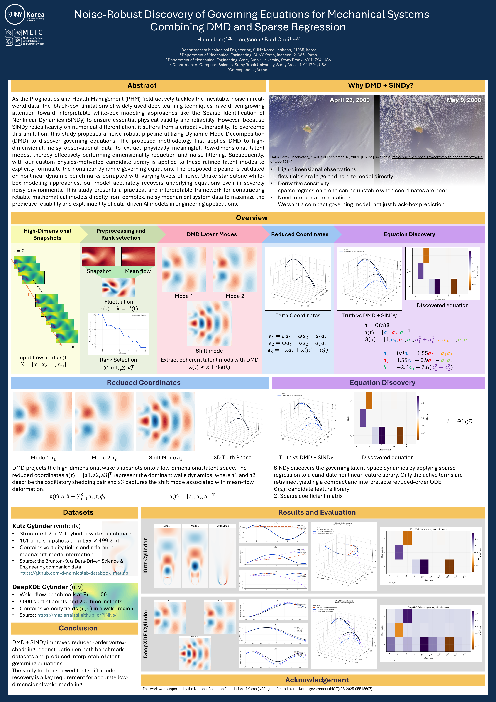
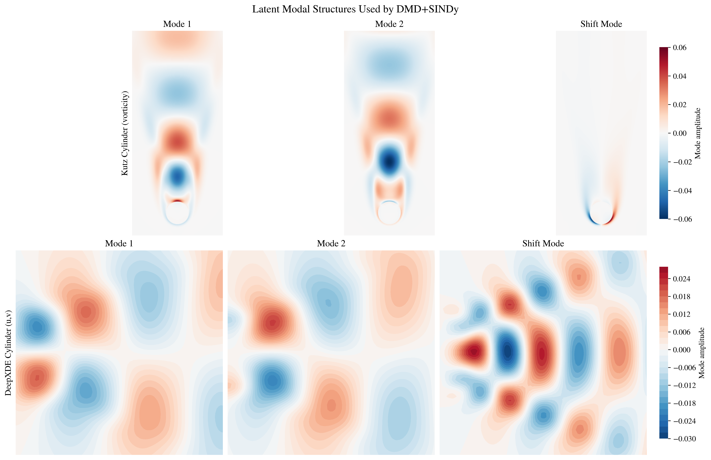
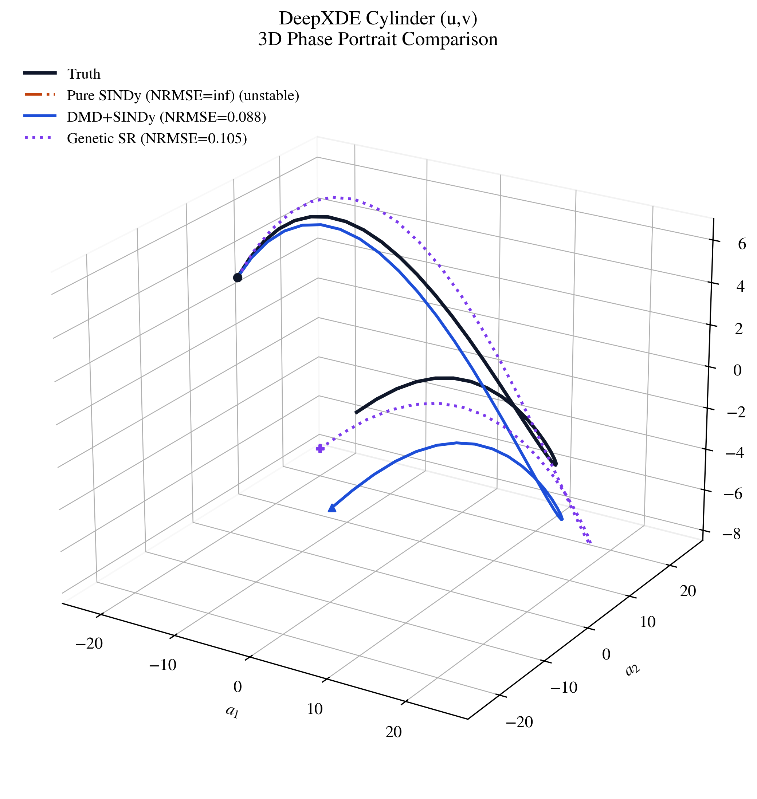
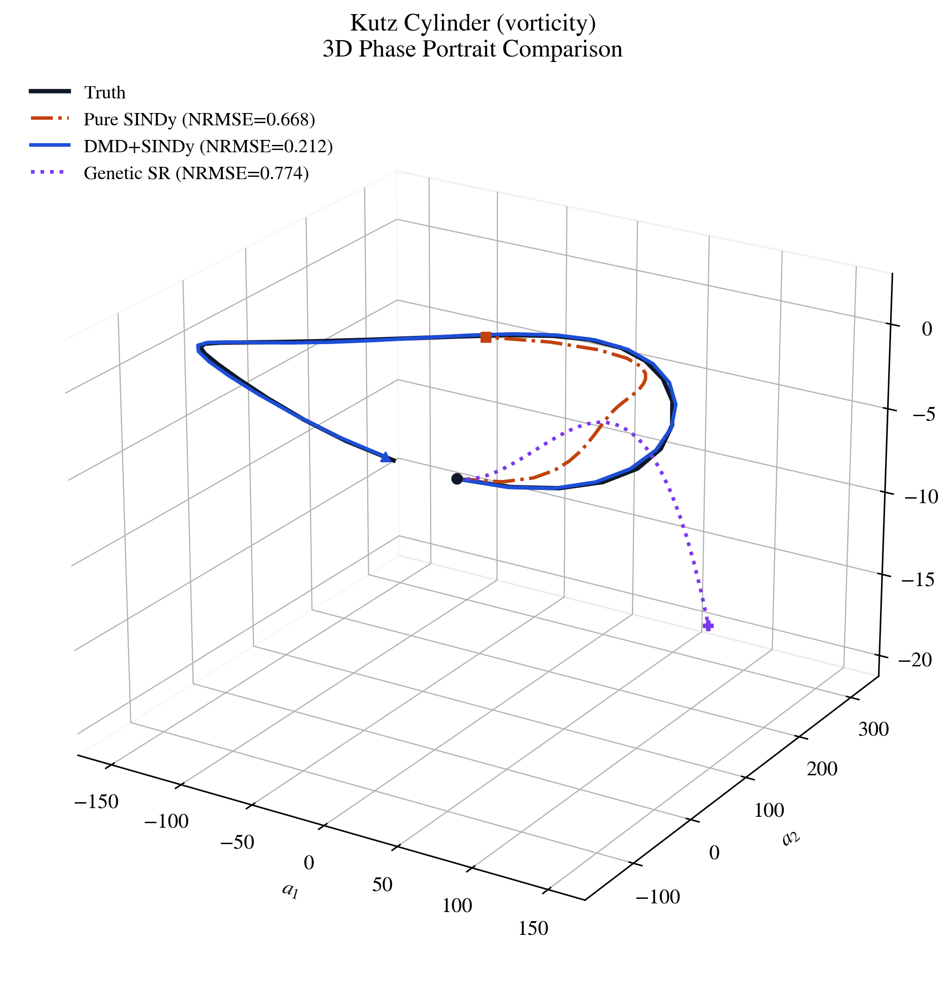

# KSME 2026 Vortex Benchmark

This repository contains the scripts, result tables, and KSME submission files for a DMD + SINDy workflow for noise-robust governing-equation discovery in vortex-shedding data.

## KSME 2026 Poster


## Repository Layout

- `docs/`: final KSME abstract and poster files.
- `src/`: reusable benchmark module.
- `scripts/`: executable analysis and figure-generation scripts.
- `results/`: generated CSV/Markdown reports.
- `data/`: raw-data landing area.

## KSME Submission Files

- `docs/HajunJang_KSME_2026_abstract.pdf`
- `docs/HajunJang_KSME_2026_abstract.docx`
- `docs/HajunJang_KSME2026Poster.pdf`

## Data

### Expected Layout

```text
data/
  benchmarks/
    kutz_cylinder/
      CYLINDER_ALL.mat
      CYLINDER_basis.mat
    deepxde_cylinder/
      cylinder_nektar_wake.mat
```

You can also keep these files outside the repository and point the scripts to them:

```bash
export VORTEX_BENCHMARK_DATA_ROOT=/path/to/benchmarks
```

### Download Sources
create a folder with its name 'data'

#### Kutz Cylinder Wake

Download the companion data archive for *Data-Driven Science and Engineering*:

- Archive page/link used by common DMD examples: `http://databookuw.com/DATA.zip`
- Companion repository: `https://github.com/dynamicslab/databook_matlab`

After extracting `DATA.zip`, copy these files into `data/benchmarks/kutz_cylinder/`:

- `DATA/FLUIDS/CYLINDER_ALL.mat`
- `DATA/FLUIDS/CYLINDER_basis.mat`

#### DeepXDE / Nektar Cylinder Wake

Download the cylinder wake dataset from the original PINNs data repository:

- Browser URL: `https://github.com/maziarraissi/PINNs/blob/master/main/Data/cylinder_nektar_wake.mat`
- Raw download URL: `https://raw.githubusercontent.com/maziarraissi/PINNs/master/main/Data/cylinder_nektar_wake.mat`

Save it as:

```text
data/benchmarks/deepxde_cylinder/cylinder_nektar_wake.mat
```

## Environment

```bash
python -m pip install -r requirements.txt
```

## Reproducing Outputs

Run the scripts from the repository root:

```bash
python scripts/run_vortex_benchmark.py
python scripts/benchmark_vortex_shedding.py
python scripts/finalize_vortex_results.py
python scripts/benchmark_experimental_single_cylinder.py
python scripts/experimental_single_cylinder_re100.py
python scripts/piv_challenge_case_b_test.py
python scripts/generate_poster_overview_assets.py
```

## Results

<p align="center">
  
  
  
</p>